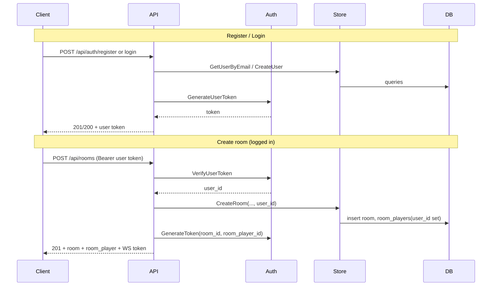

# Phase 09: Users and user info storage

**Goal**: Introduce persistent user accounts so the backend can store user info (profile, identity across rooms). Anonymous play remains supported: when a user is logged in and creates or joins a room, we associate that room player with their user; when not logged in, behavior stays as today (no user link).

---

## Summary

- **Users table**: Store user identity (id, email, password_hash, display_name, created_at, updated_at). Optional: avatar_url, settings_json.
- **Link room_players to users**: Add nullable `user_id` on `room_players`. When create/join is called with a valid user session token, set `room_players.user_id`; otherwise leave null (anonymous).
- **Auth**: Register (POST /api/auth/register), Login (POST /api/auth/login) returning a **user session token** (JWT/HMAC with user_id + exp). Reuse existing HMAC approach in [internal/auth/token.go](internal/auth/token.go) with a second claim type (user_id) and helpers: `GenerateUserToken`, `VerifyUserToken`.
- **Me endpoint**: GET /api/users/me — return current user profile when Authorization Bearer is a valid user session token; 401 otherwise.
- **Create/join room**: Accept optional Bearer user token. If present and valid, set `room_players.user_id` when creating or joining; response still includes the existing room-scoped WebSocket token for WS auth.

---

## Current state (no users)

- [migrations/20240213000000_init.sql](migrations/20240213000000_init.sql): `rooms`, `room_players` (no user_id), `games`, `game_players`, etc.
- [internal/auth/token.go](internal/auth/token.go): Room-scoped tokens only (room_id, room_player_id, exp).
- Create/join in [internal/httpapi/handler/room.go](internal/httpapi/handler/room.go) return a room-scoped token; no notion of “logged-in user”.

---

## Concrete steps

### 1. Migration: users table and room_players.user_id

- New migration (e.g. `migrations/YYYYMMDDHHMMSS_add_users.sql`):
  - **users**: `id` UUID PK, `email` TEXT NOT NULL UNIQUE, `password_hash` TEXT NOT NULL, `display_name` TEXT NOT NULL, `created_at`/`updated_at` TIMESTAMPTZ. Optional: `avatar_url` TEXT, `settings_json` JSONB DEFAULT '{}'.
  - **room_players**: add `user_id UUID REFERENCES users(id) ON DELETE SET NULL`. Index on `room_players(user_id)` for “rooms this user is in” queries later if needed.
- Down: drop `user_id` column, drop `users` table.

### 2. SQL and store layer for users

- **Queries**: Add queries (in [internal/db](internal/db) or sqlc if used) for: InsertUser, GetUserByID, GetUserByEmail, UpdateUser (optional, for profile updates).
- **UserStore** (new [internal/store/user.go](internal/store/user.go) or extend existing store): CreateUser(email, passwordHash, displayName), GetUserByEmail, GetUserByID. Use bcrypt for password hashing (same as room passwords in [internal/store/room.go](internal/store/room.go)).
- **Room store**: Update CreateRoom and JoinRoom to accept an optional `userID *string`; when non-nil, set `room_players.user_id` in the insert. Existing [internal/db/rooms.sql](internal/db/rooms.sql) (or equivalent) will need an extra column and insert param.

### 3. User session token (auth package)

- In [internal/auth/token.go](internal/auth/token.go):
  - Add **UserClaims** struct: `UserID string`, `Exp int64`.
  - **GenerateUserToken(userID string, secret []byte, expiry time.Duration)** → (token, expiresAt, err). Same HMAC-SHA256 format as existing tokens; payload is UserClaims so existing VerifyToken will fail (wrong shape); add **VerifyUserToken(token string, secret []byte)** that decodes payload as UserClaims and validates exp.
  - Keep existing Claims/GenerateToken/VerifyToken for room-scoped WebSocket tokens unchanged.
- Config: Reuse the same secret (e.g. WEBSOCKET_TOKEN_SECRET) for user tokens, or introduce USER_TOKEN_SECRET; phase can use one secret for simplicity.

### 4. HTTP: register and login

- **POST /api/auth/register**: Body: email, password, display_name. Validate (email format, password length, display_name length). Hash password, insert user (GetUserByEmail first → 409 if exists). Return 201 with user session token (and optionally user id, email, display_name, expires_at).
- **POST /api/auth/login**: Body: email, password. GetUserByEmail; verify password with bcrypt. Return 200 with user session token (and optional user payload). 401 if not found or wrong password.
- Handlers in [internal/httpapi/handler](internal/httpapi/handler) (e.g. auth.go). Register routes under `/api/auth` in [internal/httpapi/router.go](internal/httpapi/router.go).

### 5. Optional user middleware and GET /api/users/me

- **Middleware** (e.g. OptionalUser in [internal/httpapi/middleware.go](internal/httpapi/middleware.go)): Read Authorization Bearer; if absent, call next with context unchanged. If present, VerifyUserToken; if valid, set context key (e.g. user_id); if invalid, call next without user (do not 401 so anonymous create/join still works). Use this middleware on create/join and on GET /api/users/me.
- **GET /api/users/me**: Mount with OptionalUser (or RequireUser that 401s when no user). If user_id in context, load user by id, return 200 with { id, email, display_name, created_at, ... } (exclude password_hash). 401 if no valid user token.

### 6. Create room and join room: set user_id when logged in

- **CreateRoom**: After OptionalUser, if context has user_id, pass it to store.CreateRoom so the new room_players row gets user_id set. Request body stays the same (display_name, etc.); display_name can still override for that room or default to user’s display_name (product choice: e.g. default to user’s display_name if logged in).
- **JoinRoom**: Same: if user_id in context, pass to store.JoinRoom so the new room_players row gets user_id. Response format unchanged (room, room_player, token, etc.); room_player may now include user_id in API if desired (optional).

### 7. API docs and validation

- Validate email format and length, password min/max length, display_name length on register. Rate-limit login/register (e.g. by IP) using existing [internal/ratelimit](internal/ratelimit) if not already applied to a broader group.
- Add swag comments for new endpoints; regenerate Swagger per [docs/API.md](docs/API.md).

---

## Data flow (high level)

---

## References

- [migrations/20240213000000_init.sql](migrations/20240213000000_init.sql) — current schema; add users and room_players.user_id in new migration.
- [internal/auth/token.go](internal/auth/token.go) — add user token type and VerifyUserToken.
- [internal/store/room.go](internal/store/room.go) — CreateRoom, JoinRoom; add optional userID and pass to DB.
- [internal/httpapi/handler/room.go](internal/httpapi/handler/room.go) — create/join: read user from context, pass to store.
- New: internal/store/user.go, internal/httpapi/handler/auth.go, optional middleware for user context.

---

## Acceptance criteria

- Migration adds `users` table and `room_players.user_id`; app starts and migrations run.
- POST /api/auth/register creates user and returns user session token; duplicate email returns 409.
- POST /api/auth/login returns user session token for valid email/password; invalid returns 401.
- GET /api/users/me returns current user when Bearer user token is valid; 401 without/invalid token.
- Creating a room with valid user Bearer token sets room_players.user_id for the host; without token, user_id remains null.
- Joining a room with valid user Bearer token sets room_players.user_id for the joining player; without token, user_id remains null.
- Existing create/join flows without user token still work (anonymous play unchanged).
- Swagger/docs updated for new endpoints.

