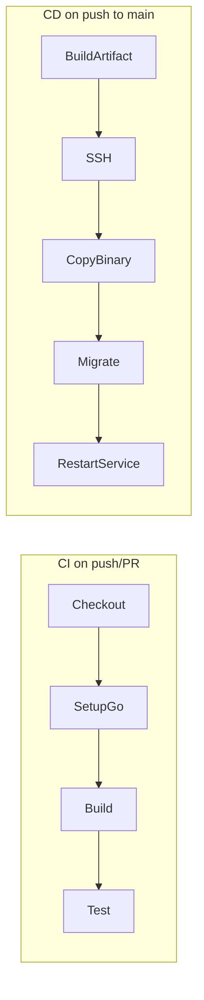

# Phase 8: Deploy to EC2 using GitHub Actions CI/CD

**Goal**: Automate build, test, and deployment of the Avalon backend to an AWS EC2 instance via GitHub Actions. Every push runs CI; deployments run on push to `main` (or a chosen branch/tag).

---

## Current state

- **App**: Single Go binary from [cmd/server/main.go](cmd/server/main.go); Go 1.24.
- **Config**: Env vars `AVALON_HTTP_ADDR` (default `:8080`), `DATABASE_URL` (required), `MIGRATIONS_DIR` (default `migrations`), `WEBSOCKET_TOKEN_SECRET`.
- **Health**: `GET /healthz` for readiness.
- **No existing CI/CD**: No `.github/workflows`, no Dockerfile.

---

## Architecture (high level)

- **CI**: Checkout → setup Go → `go build ./cmd/server` → `go test ./...`. No deployment.
- **CD**: Build Linux binary → connect to EC2 (SSH) → copy binary + migrations → run migrations → restart systemd service.

---

## 1. GitHub Actions workflow

**File**: [.github/workflows/deploy.yml](.github/workflows/deploy.yml) (new).

- **Trigger**: `push` to `main` (and optionally `workflow_dispatch`); optionally run CI on all branches/PRs (separate job or same file with `if`).
- **Jobs**:
  - **ci** (always): Set up Go 1.24, run `go build ./cmd/server`, `go test ./...`. No secrets required.
  - **deploy** (only on `main`, and only if ci succeeds): Build Linux amd64 binary (`GOOS=linux GOARCH=amd64 go build -o avalon-server ./cmd/server`), upload as artifact; then deploy job downloads it and uses SSH to copy to EC2 and restart the service.
- **Secrets** (repo-level): `EC2_HOST`, `EC2_SSH_KEY` (private key for `ec2-user` or chosen user), `DEPLOY_USER` (e.g. `ec2-user`), `DEPLOY_PATH` (e.g. `/home/ec2-user/avalon`). Optional: `DATABASE_URL` and `WEBSOCKET_TOKEN_SECRET` if you inject them from GitHub (less ideal); preferred: keep these only on EC2 in an env file.
- **Deploy steps**: Install `rsync` or use `scp` in runner; copy binary and `migrations/` to EC2; SSH run migrations (e.g. `DATABASE_URL=... ./avalon-server --migrate-only` or a small script that runs goose); then `sudo systemctl restart avalon` (or equivalent).

**Alternative**: Use AWS Systems Manager (SSM) Session Manager + S3 artifact instead of SSH key; then EC2 instance needs IAM role and SSM agent. Plan below assumes SSH for simplicity.

---

## 2. EC2 and app requirements

- **EC2**: Amazon Linux 2 or 2023; open SSH (22) from GitHub’s IPs or use a self-hosted runner in a VPC. Instance with IAM role only if you later add S3/SSM.
- **PostgreSQL**: Available from EC2 (RDS in same VPC, or Postgres on same/different instance). `DATABASE_URL` must be set on the server (e.g. in systemd or env file).
- **No Docker required**: Single binary + systemd keeps the first iteration simple; optional Phase 8b can add Dockerfile + deploy container to EC2.

---

## 3. EC2 server setup (manual one-time)

- Install Go (optional, only if you run migrations with a Go binary that uses goose) or install goose and run migrations from a script. **Simpler**: ship the same binary; run migrations in the same process at startup (current [cmd/server/main.go](cmd/server/main.go) already runs migrations on startup). So no separate migrate step if the app starts after copy; only “copy binary + migrations, then restart service.”
- Create app directory, e.g. `/home/ec2-user/avalon`; place `avalon-server` binary and `migrations/` folder there.
- **Systemd unit** (e.g. `/etc/systemd/system/avalon.service`): run `/home/ec2-user/avalon/avalon-server` with `WorkingDirectory=/home/ec2-user/avalon`, and environment from `EnvironmentFile=/home/ec2-user/avalon/.env` (or `Environment=` lines). `.env` must set `DATABASE_URL`, `WEBSOCKET_TOKEN_SECRET`, and optionally `AVALON_HTTP_ADDR`, `MIGRATIONS_DIR`.
- **Security**: Restrict `.env` permissions (e.g. `chmod 600`); do not commit `.env`; do not store production secrets in GitHub if avoidable.

---

## 4. Deployment flow (detailed)

1. **Build**: In deploy job, build Linux binary; optionally embed version (e.g. `-ldflags "-X main.Version=$(git describe --tags --always)"`).
2. **Copy**: `scp` or `rsync` `avalon-server` and `migrations/` to `$DEPLOY_USER@$EC2_HOST:$DEPLOY_PATH/`.
3. **Migrations**: Already run on app startup (current code); no extra step unless you want a separate “migrate only” command. If you add one later, deploy can run it before restart.
4. **Restart**: `ssh $DEPLOY_USER@$EC2_HOST 'sudo systemctl restart avalon'`.
5. **Smoke check** (optional): `curl -f http://$EC2_HOST:8080/healthz` (or use EC2 public IP/domain and correct port).

---

## 5. Plan document and README update

- Add [plans/phase-08-deploy-ec2-github-actions.md](plans/phase-08-deploy-ec2-github-actions.md) with the above steps, secret list, and optional “Phase 8b: Docker on EC2” and “SSM instead of SSH” notes.
- Update [plans/README.md](plans/README.md) to add Phase 8 row and “Work through phases 1–8” (or “1–7 for app, 8 for deploy”).

---

## 6. Optional follow-ups (not in initial scope)

- **Dockerfile**: Multi-stage build; deploy Docker image to EC2 (pull and run with `docker run` or compose). Requires Docker on EC2 and possibly a registry (ECR/GHCR).
- **Secrets on EC2**: Prefer AWS Secrets Manager or SSM Parameter Store + IAM role so the server pulls secrets at startup instead of keeping a long-lived `.env` with DB URL.
- **Blue/green or rollback**: Keep previous binary; on failed health check, roll back and restart.

---

## Files to add/change

| Action | File                                                                                                    |
| ------ | ------------------------------------------------------------------------------------------------------- |
| Add    | `.github/workflows/deploy.yml` — CI (build + test) and CD (build artifact, SSH copy, systemctl restart) |
| Add    | `plans/phase-08-deploy-ec2-github-actions.md` — Phase 8 plan doc (steps, secrets, EC2 setup)            |
| Edit   | `plans/README.md` — Add Phase 8 row and optional “8 for deploy” note                                    |

---

## Acceptance criteria

- Pushing to `main` runs tests and, on success, deploys the Linux binary to EC2 and restarts the service.
- Server runs with existing behavior; `GET /healthz` returns 200 after deploy.
- Production secrets (`DATABASE_URL`, `WEBSOCKET_TOKEN_SECRET`) are not stored in GitHub; they live only on EC2 (e.g. in `.env` or env file for systemd).

